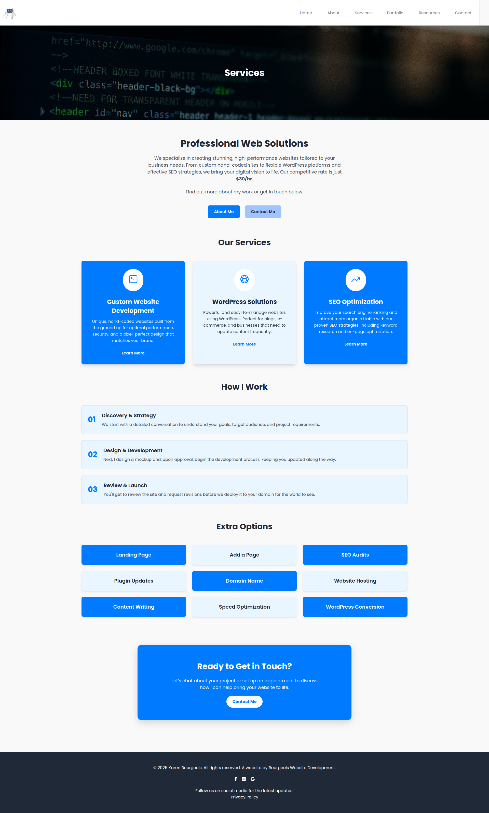
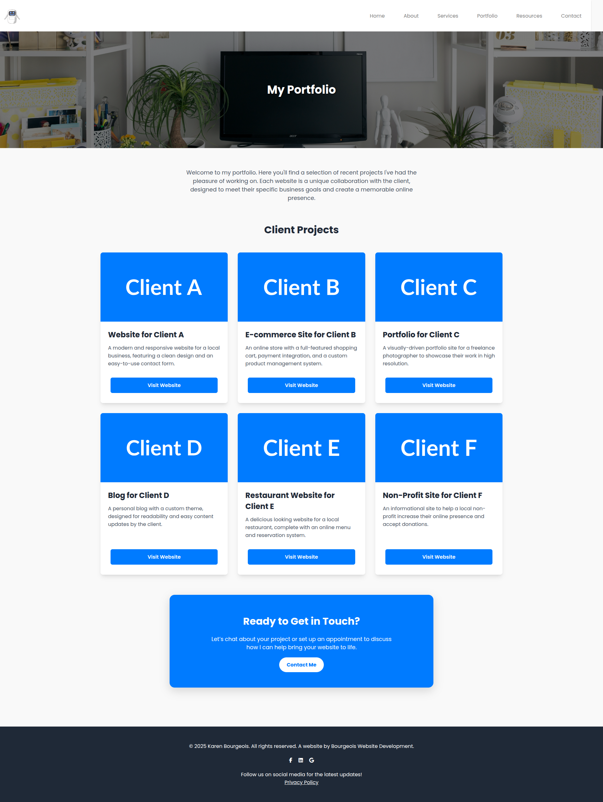
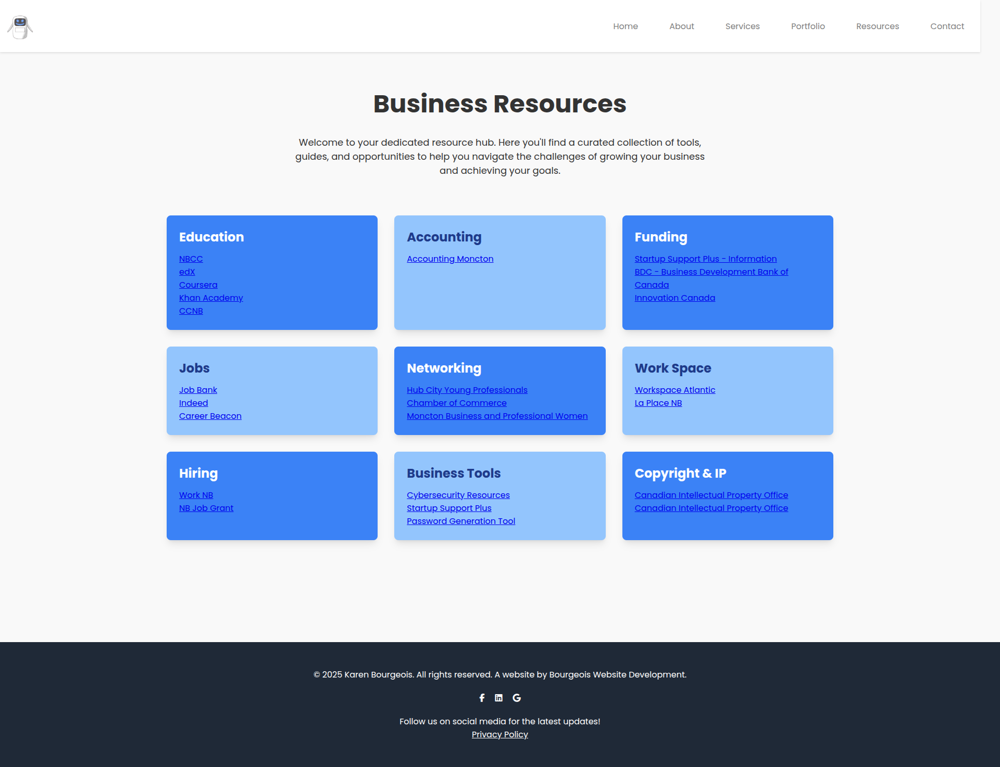
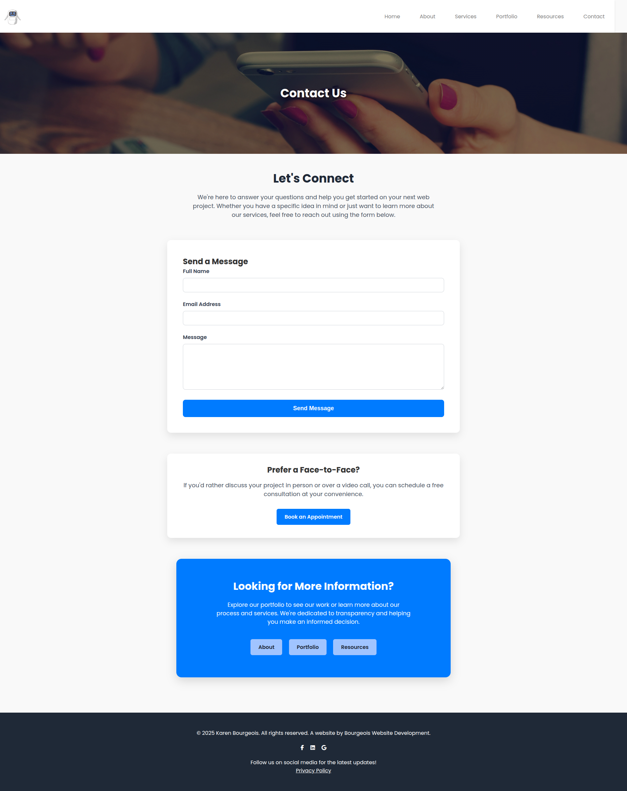

# Bourgeois Website Development


## Contents

[Description](#description) |
[Features](#features) |
[Images](#images) |
[Installation](#installation) |
[Usage](#usage) |
[Credits](#credits) |
[Testing](#testing)

## Description

In today's digital marketplace, your website is more than just an online brochure—it's your most powerful tool for lead generation, sales, and brand building. We specialize in crafting strategic, results-driven websites that are not only visually stunning but are also engineered to convert visitors into customers.

We combine cutting-edge technology with data-driven design to build fast, secure, and scalable web solutions that align with your business objectives. From sophisticated e-commerce platforms to custom enterprise web applications, we are your dedicated partner in achieving digital excellence.

## Features

### Key Services:

- Custom Website Development

- E-Commerce & Online Store Solutions

- Content Management System (CMS) Integration (WordPress)

- Responsive Design for Mobile, Tablet, & Desktop

- Website Performance & Speed Optimization

- Ongoing Maintenance & Security Support

## Images











## Instation

### Project Installation & Contribution Guide

Welcome! We're excited to have you contribute. Please follow these instructions carefully to get your local environment set up and to ensure a smooth contribution process.

---

#### 1. Fork the Repository

First, you need to create your own copy of the main repository. This is called "forking."

* Navigate to the main project repository page on GitHub.
* Click the **Fork** button in the top-right corner of the page. This will create a copy of the repository under your own GitHub account.


---

#### 2. Clone Your Fork & Set Up SSH

Now, you'll clone your forked repository to your local machine. We use SSH for authentication, so you'll need to have an SSH key set up with your GitHub account.

##### Getting Your SSH Key

If you haven't set up an SSH key with GitHub before, follow their official guide. It's the most secure and up-to-date resource.
* **[Generating a new SSH key and adding it to the ssh-agent](https://docs.github.com/en/authentication/connecting-to-github-with-ssh/generating-a-new-ssh-key-and-adding-it-to-the-ssh-agent)**
* **[Adding a new SSH key to your GitHub account](https://docs.github.com/en/authentication/connecting-to-github-with-ssh/adding-a-new-ssh-key-to-your-github-account)**

##### Cloning the Repository

1.  On your forked repository's GitHub page, click the green **<> Code** button.
2.  Make sure the **SSH** tab is selected.
3.  Click the **copy** icon to copy the SSH URL (it should look like `git@github.com:YOUR_USERNAME/REPOSITORY_NAME.git`).
4.  Open your terminal or command prompt, navigate to the directory where you want to store the project, and run the following command:

    ```bash
    git clone git@github.com:YOUR_USERNAME/REPOSITORY_NAME.git
    ```

---

#### 3. Initialize and Configure Your Local Repository

Once cloned, you need to configure your local copy to track the original project repository. This allows you to pull in changes and keep your fork up to date.

1.  Navigate into your new project directory:
    ```bash
    cd REPOSITORY_NAME
    ```
2.  Add the original repository as a remote named `upstream`:
    ```bash
    git remote add upstream git@github.com:ORIGINAL_OWNER/REPOSITORY_NAME.git
    ```
3.  Verify that you have two remotes: `origin` (your fork) and `upstream` (the original):
    ```bash
    git remote -v
    ```
    You should see an output similar to this:
    ```
    origin    git@github.com:YOUR_USERNAME/REPOSITORY_NAME.git (fetch)
    origin    git@github.com:YOUR_USERNAME/REPOSITORY_NAME.git (push)
    upstream  git@github.com:ORIGINAL_OWNER/REPOSITORY_NAME.git (fetch)
    upstream  git@github.com:ORIGINAL_OWNER/REPOSITORY_NAME.git (push)
    ```

---

#### 4. The Contribution Workflow

All new work must be done on a feature branch based on `development`. **Never push directly to `main` or `development`.**

1.  First, ensure your `development` branch is up to date with the `upstream` repository:
    ```bash
    git fetch upstream
    git checkout development
    git merge upstream/development
    ```
2.  Create a new branch for your feature or bug fix. Use a descriptive name.
    ```bash
    git checkout -b your-feature-name
    ```
3.  Make your changes, then add and commit them:
    ```bash
    git add .
    git commit -m "feat: A clear and concise commit message"
    ```
4.  Push your new branch **only to your fork (`origin`)**:
    ```bash
    git push origin your-feature-name
    ```

---

#### 5. Submitting a Pull Request (PR)

Once you've pushed your branch, you can open a Pull Request.

1.  Go to your forked repository on GitHub. A prompt will often appear to create a PR from your recently pushed branch.
2.  Click **"Compare & pull request"**.
3.  Ensure the base repository is the **original project** and the base branch is `development`. The head repository should be your fork and the compare branch should be your `your-feature-name` branch.
4.  Add a descriptive title and a clear summary of the changes you made.
5.  In the right-hand sidebar, under **"Reviewers,"** assign either **Karen** or **Eric** to review your PR.
6.  Click **"Create pull request"**.

**A review and approval are mandatory before any code can be merged.** Please be prepared to make changes based on feedback.

#### **There is a license to review**

[License](Licence.md)

## Usage Policy

This website is the official online presence for **Bourgeois Website Development** and is intended solely for informational purposes. It serves to provide current and prospective clients with details about our services, projects, and contact information.

All content on this website, including text, images, logos, and overall design, is the intellectual property of Bourgeois Website Development and is protected by copyright law.

Reproduction, distribution, or duplication of any material on this site, in whole or in part, for any commercial or non-commercial purpose, is **strictly prohibited**. Any unauthorized use of this website's content may violate copyright laws.

## Credits

- Karen Bourgeois
- bourgeoiswebsites@gmail.com
- [LinkedIn](https://www.linkedin.com/company/bourgeois-website-development/ )
- [Facebook](https://www.facebook.com/profile.php?id=61579091977188)

## Testing

We appreciate your help in making our site as stable and reliable as possible! 🐛

You can contribute by testing in one of two ways:

Local Environment: For comprehensive testing, you can follow the installation instructions to set up the project on your local machine.

Live Website: Alternatively, you are welcome to test the production version of the site directly at www.bourgeoiswebsites.com.

### Reporting Bugs
If you encounter any bugs, code errors, or unexpected behavior, please send us a message or, preferably, open an issue on our GitHub repository. When reporting an issue, please provide a clear description of the problem, the steps to reproduce it, and any relevant screenshots. Your feedback is invaluable!